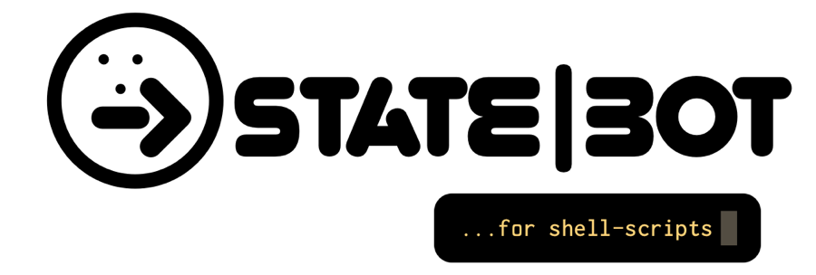

# Statebot-sh



Write more robust and understandable programs.

Statebot hopes to make [Finite State Machines](https://en.wikipedia.org/wiki/Finite-state_machine) (FSMs) a little more accessible.

This is a minimal but useful shell port of the version that runs in [Node and the browser](https://shuckster.github.io/statebot/). It employs a simple caching mechanism with `/tmp/statebots.csv` in order to persist the states of your machines across different runs, and optionally the events too.

- [Quick Start](#quick-start)
  - [A small example](#a-small-example)
- [The API](#the-api)
  - [Handling events and transitions](#handling-events-and-transitions)
  - [Limitations](#limitations)
- [Why?](#why)
- [Credits](#credits)
- [License](#license)

Documentation is in this README, and examples can be found in `/examples`. It's not required reading, but the original JavaScript version has [extensive documentation](https://shuckster.github.io/statebot/) that may be helpful with getting-to-grips with this port. In particular, familiarity with the [chart syntax](https://shuckster.github.io/statebot/#statebotchart) would be helpful to know (it's not very complicated.)

# Quick Start

Download `statebot.sh`:

```sh
curl https://raw.githubusercontent.com/shuckster/statebot-sh/master/statebot.sh > statebot.sh
```

Make it executable:

```sh
# You don't need to make Statebot executable, but if you do,
# running it will display an example and the API documentation.
chmod +x statebot.sh
./statebot.sh
```

## A small example:

```sh
#!/bin/sh
STATEBOT_LOG_LEVEL=4
# 0 for silence, 4 for everything

STATEBOT_USE_LOGGER=0
# 1 to use the `logger` command instead of `echo`

PROMISE_CHART='
  idle ->
    // Behaves a bit like a JS Promise
    pending ->
      (rejected | resolved) ->
    idle
'

# Implement a "perform_transitions" function to act on events:
perform_transitions () {
  local ON=""; local THEN=""

  case $1 in
    'idle->pending')
      ON="start"
      THEN="statebot_emit okay persist"
    ;;
    'pending->resolved')
      ON="okay"
      THEN="statebot_emit done"
    ;;
    'rejected->idle'|'resolved->idle')
      ON="done"
    ;;
  esac

  echo $ON $THEN
}

# Implement an "on_transitions" function to act on transitions:
on_transitions () {
  local THEN=""

  case $1 in
    'idle->pending')
      THEN="hello_world"
    ;;
    'rejected->idle'|'resolved->idle')
      THEN="all_finished"
    ;;
  esac

  echo $THEN
}

# Implement any "THEN" functions:
hello_world() { echo "Hello, World!"; }
all_finished() { echo "That was easy!"; }

# Import Statebot
cd "${0%/*}" || exit
# (^- change the working-directory to where this script is)
. ./statebot.sh

statebot_init "demo" "idle" "start" "$PROMISE_CHART"
#   machine name -^     ^      ^           ^
#  1st-run state -------+      |           |
#  1st-run event --------------+           |
# statebot chart --------------------------+

echo      "Current state: $CURRENT_STATE"
echo     "Previous state: $PREVIOUS_STATE"
echo "Last emitted event: $PREVIOUS_EVENT"

if [[ "$1" == "" ]]; then
  exit
fi

# Allow resetting & emitting-events from the command-line:
if [[ "$1" == "reset" ]]; then
  statebot_reset
else
  statebot_emit "$1"
fi
```

This example, along with some more complex ones, is available in the `/examples` folder.

# The API

This port implements a subset of the API in the JavaScript version of Statebot.

You can see API documentation by running `./statebot.sh --api`

Here's the output:

```sh
statebot_inspect "$YOUR_CHART"
  #
  # When developing your charts, it is useful
  # to see the transitions they represent so
  # you can copy-paste into your perform/
  # on_transitions() functions.
  #
  # Use statebot_inspect() to give you this
  # information, and the states too.

statebot_init "example" "idle" "start" "idle -> done"
  #                 ^      ^     ^         ^
  #   machine name -|      |     |         |
  #  1st-run state --------+     |         |
  #  1st-run event --------------+         |
  # statebot chart ------------------------+
  #
  # If your machine does not yet have an
  # entry in the CSV database, this will
  # initialise it with the values passed-in.
  #
  # If the machine already exists, then the
  # values in the DB will be used from this
  # point onwards.
  #
  # Only one machine is allowed per script,
  # so do not call this more than once in
  # order to try and have multiple state-
  # machines in the same script! It is easy
  # to use Statebot in many different and
  # independent scripts.
  #
  # (Charts are not stored in the DB, and
  # are specified as the last argument
  # in order to enforce setting defaults
  # for the initial state/event too.)

statebot_emit "start" persist
  #              ^       ^
  # event name --+       |
  #                      |
  # Store this event ----+ (optional)
  # for a future run instead of calling it
  # immediately.
  #
  # When you run your script again later, the
  # event will be picked-up by the call to
  # statebot_init().

statebot_enter "pending"
  #                ^
  #   state name --+
  #
  # Changes to the specified state, if allowed
  # by the rules in the state-chart.

statebot_reset
  #
  # Reset the machine to its 1st-run state
  # & event. No events will be emitted.

statebot_states_available_from_here
  #
  # List the states available from the
  # current-state.

# Details about the current machine:
echo "     Current state: $CURRENT_STATE"
echo "    Previous state: $PREVIOUS_STATE"
echo "Last emitted event: $PREVIOUS_EVENT"
```

## Handling events and transitions

If you want Statebot to do something when you run `statebot_emit()` and `statebot_enter()` other than just changing the `CURRENT_STATE` variable, then you need to define at least one of these functions:

- `perform_transitions()`
- `on_transitions()`

These should be available before calling `statebot_init()`.

`perform_transitions()` has the following signature:

```sh
perform_transitions () {
  local ON=""; local THEN=""

  # A string in the form `from->to` will be passed-in
  # as the only argument ($1) to this function, and it
  # represents a state-transition.
  case $1 in
    'idle->pending')
      ON="start"
      THEN="statebot_emit okay persist"
    ;;
    'pending->resolved')
      ON="okay"
      THEN="statebot_emit done"
    ;;
    'rejected->idle'|'resolved->idle')
      ON="done"
    ;;
  esac

  echo $ON $THEN
  # The job of this function is to "echo" the event-
  # name that will cause the transition to happen.
  #
  # Optionally, it can also "echo" a command to run
  # after the transition happens.
  #
  # Following the convention set in the JS version
  # of Statebot, this is called a "THEN" command.
  # It can be anything you like, including a Statebot
  # API call.
  #
  # It's important to just echo the name of an event
  # (and optional command, too) rather than execute
  # something directly! Anything that is echo'ed by
  # this function that is not an event or command-
  # name might result in some wild behaviour.
}
```

`on_transitions()` is similar:

```sh
on_transitions () {
  local THEN=""

  # A string in the form `from->to` will be passed-in
  # as the only argument ($1) to this function, and it
  # represents the state-transition that just happened.
  case $1 in
    'idle->pending')
      THEN="echo Hello, World!"
    ;;
    'rejected->idle'|'resolved->idle')
      THEN="all_finished"
    ;;
  esac

  echo $THEN
  # The job of this function is to "echo" the name of
  # a command you want to run.
  #
  # Again, it's important to just echo the name of
  # a command rather than executing it directly!
}
```

Note that `statebot_emit()` will also call `on_transitions()` if an event causes a transition to happen, so long as the function has been defined.

## Limitations

The JavaScript version of Statebot obviously has a bigger API, but it also allows more complex transition-names in its `performTransitions()` and `onTransitions()` hitchers, for example:

```js
machine.onTransitions({
  'resolved | rejected -> done': function () {
    console.log('All finished')
  }
})
```

To emulate this in Statebot-sh, the function `case_statebot` is offered:

```sh
on_transitions () {
  local THEN=""

  if case_statebot $1 '
    resolved | rejected -> done
  '
  then
    THEN="echo 'All finished'"
  fi

  echo $THEN
}
```

It takes a transition as the first-argument, and a statebot-chart as the second. If the transition exists in the chart, an exit-code of `1` is returned.

Abusing this will manifest as a performance-hit on slow devices, so I recommend using it only in a wildcard `*)` at the end of a regular case-statement.

For example:

```sh
perform_transitions () {
  local ON=""; local THEN=""

  case $1 in
    # Handle your "simple" transitions first:
    'idle->pending')
      ON="start"
      THEN="statebot_emit okay"
    ;;

    *)
      # Now in the wildcard section, use
      # case_statebot() for your complex
      # rules:
      if case_statebot $1 '
        rejected | resolved -> idle
      '
      then
        ON="done"
      fi
    ;;
  esac

  echo $ON $THEN
}
```

# Why?

After writing the [JavaScript version of Statebot](https://shuckster.github.io/statebot/) I really wanted the same kind of API to help me write more predictable scripts for my little hobby devices.

I know **Raspberry Pi** is all the rage, so I could have just installed Node on one of those and used the JS version of Statebot. But I also have some considerably less beefy embedded devices that can't run Node, so I really liked the idea of getting Statebot running as a shell-script.

Needless to say, it now satisfies my own needs enough that I'm happy to share it. :)

I hope you find it useful!

# Contributing

My main goal with this version is to make it as portable as possible! If you find an issue with it working in your particular version of `sh` or `bash`, please file a bug!

## Credits

Statebot was inspired by a trawl through Wikipedia and Google, which in turn was inspired by [XState](https://github.com/davidkpiano/xstate) by David Khourshid. You should check it out.

The Statebot logo uses the "You're Gone" font from [Typodermic Fonts](https://typodermicfonts.com/youre-gone/). The logo was made with [Acorn](https://flyingmeat.com/acorn/). The JS documentation is written in [JSDoc](https://jsdoc.app/) and is built with [documentation.js](http://documentation.js.org/).

Statebot-sh was written by [Conan Theobald](https://github.com/shuckster/).


## License

Statebot-sh is [ISC licensed](./LICENSE).
